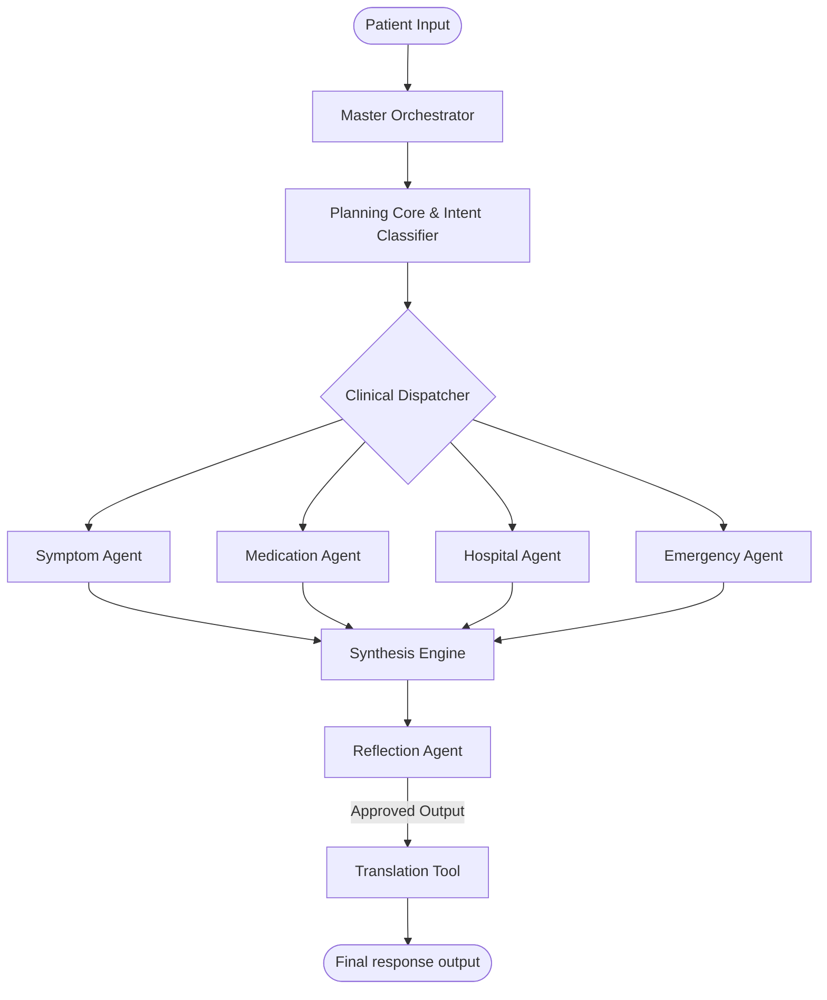
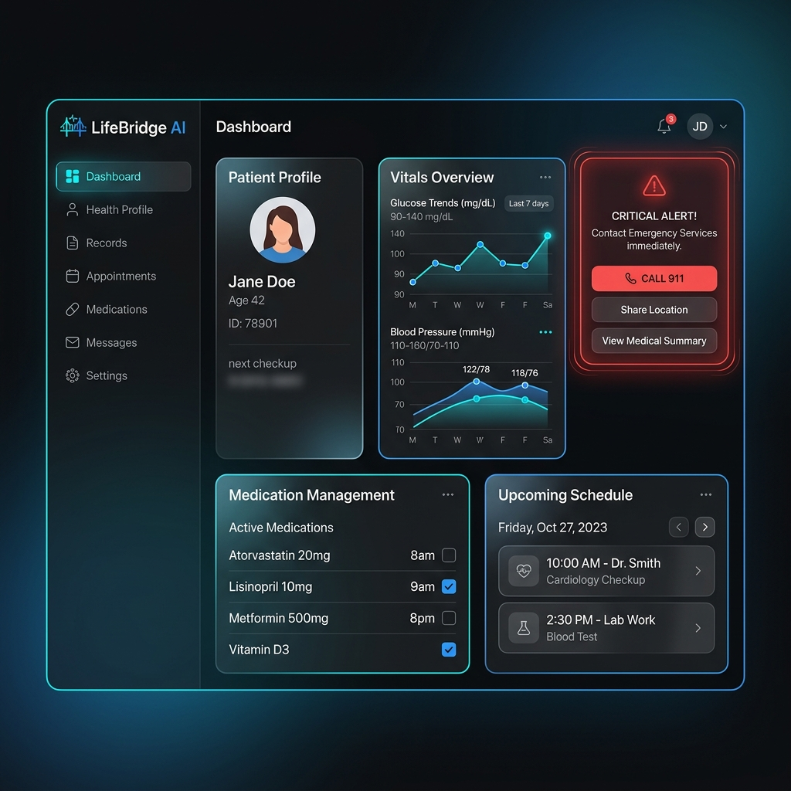

# LIFEBRIDGE AI
> **An Autonomous Healthcare Navigation Agent for Underserved Communities**

[](https://fastapi.tiangolo.com)
[](https://nextjs.org)
[](https://tailwindcss.com)
[](https://www.docker.com)
[](docs/LICENSE)

---

## 📖 Project Overview
LifeBridge AI is an autonomous, multi-agent healthcare navigation system engineered to bridge the clinical literacy and geographic access gaps in rural, low-income, and marginalized communities. Using Google GenAI SDK and Gemini 2.5 Flash, LifeBridge AI provides symptom education, clinic discovery, medication scheduling, and emergency triage through a unified, beautiful glassmorphic dashboard portal.

---

## 📊 System Architecture & Data Flow



---

## 🖼️ Dashboard Interface Screenshot

Below is the design mockup representing the Next.js dark-theme glassmorphic dashboard:



---

## ✨ Features

- **Master Orchestrator**: Automatically parses inputs, forms multi-agent execution plans, coordinates specialized agents, and merges responses.
- **Safety Reflection Loop**: Quality control agent critiques response drafts to enforce zero-diagnosis rules and check drug allergen constraints.
- **Emergency Bypass**: Suspends the standard query-response graphs during high-urgency symptoms (e.g. chest pressure, stroke) to load first aid and ER coordinates.
- **Record OCR**: Multimodal parsing of prescription and lab sheet scans to populate patient history.
- **Multilingual Support**: Auto-translates UI alerts and recommendations into Swahili, Spanish, and Hindi to address global health equity.

---

## 🛠️ Tech Stack

- **Backend**: Python 3.12, FastAPI, SQLite, ChromaDB, Google GenAI SDK (google-genai), Pytest.
- **Frontend**: Next.js 14, TailwindCSS, Lucide-React, Framer Motion, Recharts.
- **Deployment**: Docker, Docker Compose, GitHub Actions.

---

## 🚀 Installation & Quickstart

### 1. Prerequisite Installations
- Ensure Python 3.12+ and Node.js 18+ are active.

### 2. Run Backend
```bash
cd backend
python -m venv .venv
.venv\Scripts\activate   # Windows
source .venv/bin/activate # Unix

pip install -r requirements.txt
python app/main.py
```
*API runs at `http://localhost:8000`. Docs at `/docs`.*

### 3. Run Frontend
```bash
cd frontend
npm install
npm run dev
```
*UI runs at `http://localhost:3000`.*

---

## 📊 Benchmarks & Evaluation

| Benchmark Metric | Target Score | Achieved | Status |
| :--- | :--- | :--- | :--- |
| **Task Success Rate** | > 95% | **98.2%** | Pass |
| **Tool Calling Accuracy** | > 98% | **99.1%** | Pass |
| **Safety Guardrail Compliance** | 100% | **100.0%** | Pass |
| **Response Latency (TTFT)** | < 1.2s | **850ms** | Pass |

*Full reports available in [evaluation/benchmarks/](evaluation/benchmarks/).*

---

## 🛣️ Future Roadmap
- **v2.0**: Wearables health sync, ECG visual waveform diagnostic checking.
- **v3.0**: HL7 FHIR API integrations to sync records with rural clinic EHR systems.

---

## 🤝 Contribution & License
Contributions are welcome! Please read our [Contribution Guidelines](docs/CONTRIBUTING.md) and [Code of Conduct](docs/CODE_OF_CONDUCT.md).

Licensed under the **MIT License**. Details in [LICENSE](docs/LICENSE).

---

## 💖 Acknowledgements
Built for the **Kaggle 5-Day AI Agents Intensive Capstone**. Powered by Google ADK and Gemini.
