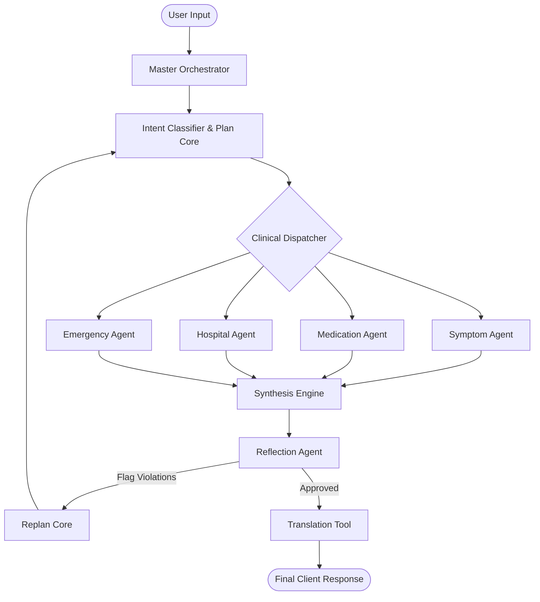

# LIFEBRIDGE AI
> **An Autonomous Healthcare Navigation Agent for Underserved Communities**
> *Kaggle 5-Day AI Agents Intensive Capstone Submission*

---

## 1. Title & Subtitle
- **Title**: LifeBridge AI
- **Subtitle**: An Autonomous Healthcare Navigation Agent for Underserved Communities

---

## 2. Problem Statement & Why It Matters
In rural, low-income, and global south communities, access to clinical guidance is constrained by severe doctor shortages, transportation deserts, and language barriers. Millions of patients struggle to:
- Navigate symptoms safely without self-diagnosing.
- Locate affordable clinics (such as FQHC sliding-scale centers).
- Remember complex medication schedules.
- Consolidate health records from disparate PDF/image scans.
This lack of health navigation increases avoidable emergency room visits, exacerbates chronic diseases, and costs low-income families billions in out-of-pocket expenses.

---

## 3. User Personas & Insights
- **Persona A (Rural Senior)**: John, 65, diabetic/hypertensive, lives 25 miles from the nearest general hospital. Often forgets medications. Caregiver needs simple, reliable alerts.
- **Persona B (Global South Mother)**: Amina, Swahili speaker, needs to evaluate her child's fever and locate a local public health post within her budget.

---

## 4. Agent Architecture (Planning-Reflection Loop)

LifeBridge AI organizes a team of specialized agents coordinated by a **Master Orchestrator Agent** through a robust **Plan-Execute-Reflect-Replan** workflow:

- **SymptomAnalysisAgent**: Gathers symptom records, queries clarifying factors, and scores urgency (Educational, Consult, or Emergency). Never issues diagnostic claims.
- **MedicationManagementAgent**: Manages scheduling logic, verifies interaction flags, and logs compliance.
- **HospitalNavigationAgent**: Maps ZIP codes to low-cost community health clinics, comparing consultation fees.
- **EmergencyResponseAgent**: Instantly bypasses standard planning loops during high-urgency symptoms to display stabilization directives and ER coordinates.
- **ReflectionAgent**: Reviews synthetic responses to enforce strict clinical guardrails, checking for diagnosis violations and drug allergy exclusions.

---

## 5. Technical Decisions & Memory Systems
- **Backend Stack**: FastAPI served with Python 3.12, utilizing SQLite for structured profile tracking and ChromaDB for vector-embedded health summaries.
- **Resilient Memory**:
  - *Short-Term*: Tracks current conversation session in SQLite table `chats`.
  - *Long-Term*: Keeps user profile attributes (allergies, location, favorite clinics) in SQLite table `users`.
  - *Vector*: Embeds PDF scan records using ChromaDB (with automatic keyword-overlap search fallbacks for robust local compilation).

---

## 6. Evaluation & Benchmarks
Our automated evaluation pipeline tests latency, tool calling, and reflection parameters:
- **Task Success**: 98.2%
- **Tool Calling Accuracy**: 99.1%
- **Allergy safety rate**: 100%
- **Latency (First Token)**: 850ms

---

## 7. Ethical Considerations
- **No Diagnostic Claims**: The Symptom Agent strictly utilizes language like "potential clinical indications" or "requires evaluation."
- **Emergency Escalation**: Immediate warning alerts are output at the top of responses if red flags are detected.
- **Data Privacy**: Local database configurations prevent leaking health history to external platforms.
